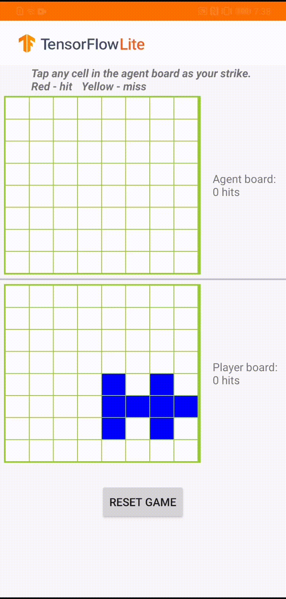

# Reinforcement Learning Android sample

TODO: b/189382433: add gif link here

This reference app is a simple board game (called 'Plane Strike') in which you
play against an agent trained by reinforcement learning. The agent runs the
reinforcement learning model on-device using TFLite.

The game rule for Plane Strike is very simple. It is a turn-based board game and
is very similar to the
[Battleship game](https://en.wikipedia.org/wiki/Battleship_\(game\)) game. The
only difference is that Battleship allows you to place battleships (2–5 cells in
a row or a column as 'battleships'); you can place multple ships. Plane Strike
instead allows you to place a ‘plane’ on the board at the beginning of the game.
In the animation we can see 2 boards (the top one is the agent's board and the
bottom one is yours), each of which has a plane on the board. Of course you have
no visibility on the agent’s plane location when the game starts. In a live
game, the agent’s plane is hidden at the beginning; you need to guess out all
the plane cells before the agent does to your plane cells. Whoever finds out all
of the opponent's plane cells first wins. Then the game restarts.

At the beginning of the game, the app will randomly place the planes for the
agent and the player. You can see the plane as 8 blue cells in your board. If
you are not happy with the placement, just reset the game so that the plane
placement will be changed.

During the gameplay, if you, as the player, tap a cell in the agent's board at
the top, and that cell turns out to be a 'plane cell', that cell will turn red
(think of this action as a hit); if it's not a 'plane cell', the cell will turn
yellow as a miss. The app also tracks the number of hits of both boards so that
you can a quick idea of the game progress.



## Requirements

*   Android Studio 4+ (installed on a Linux, Mac or Windows machine)
*   An Android device, or an Android Emulator

## Build and run

### Step 1. Clone the TensorFlow examples source code

Clone the TensorFlow examples GitHub repository to your computer to get the demo
application.

```
git clone https://github.com/tensorflow/examples
```

### Step 2. Import the sample app to Android Studio

Open the TensorFlow source code in Android Studio. To do this, open Android
Studio and select `Import Projects (Gradle, Eclipse ADT, etc.)`, setting the
folder to `examples/lite/examples/reinforcement_learning/android`

### Step 3. Run the Android app

Connect the Android device to the computer and be sure to approve any ADB
permission prompts that appear on your phone. Select `Run -> Run app.` Select
the deployment target in the connected devices to the device on which the app
will be installed. This will install the app on the device.

To test the app, open the app called `Reinforcement Learning` on your device.
Re-installing the app may require you to uninstall the previous installations.
